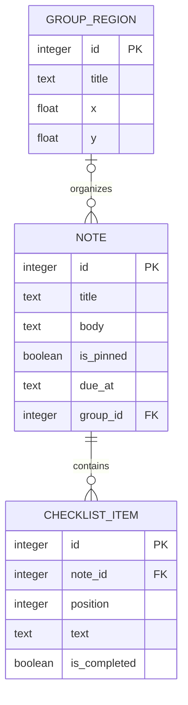

# Desknote Data Model (proposed)

**Status:** Proposed for first release  
**Revision:** 0.1  
**Date:** 2026-10-05

## Entities

### Note

- `id`: stable local identifier
- `title`, `body`: text / sanitized rich text
- `color`, `style`: presentation properties
- `due_at`: optional local calendar date/time; store normalized value plus timezone policy
- `recurrence`: optional daily, weekly, monthly, or yearly interval. Completing a dated recurring task preserves that completed note and creates the next active occurrence; month/year boundary dates clamp to the final valid day.
- `reminder_at`: optional local reminder time; notifications are opt-in
- `is_completed`, `completed_at`: task completion state and timestamp; completed tasks remain until the user deletes them
- `is_pinned`: whether a desktop window is shown after startup
- `desktop_x`, `desktop_y`, `desktop_width`, `desktop_height`: desktop note geometry
- `is_always_on_top`: default true for pinned notes
- `group_id`: optional relationship to a group
- `created_at`, `updated_at`: timestamps
- `deleted_at`: optional soft-delete marker, if recovery is adopted

### Checklist item

- `id`, `note_id`, `position`, `text`, `is_completed`, `completed_at`

### Workspace region

- `id`, `kind` (`group` or `frame`), `title`, `x`, `y`, `width`, `height`, `color`, `z_index`
- Groups organize notes; frames are visual areas and do not imply membership unless explicitly assigned.

### Workspace preferences

- `workspace_view`: persisted canvas zoom and pan offset
- `launch_at_login`: operating system startup preference (managed by the native autostart integration)

## Relationships and rules

- One note may belong to zero or one group; frames remain visual regions.
- Deleting a group/frame does not delete notes. Notes assigned to a deleted group become ungrouped.
- Unpinning changes visibility state; it does not delete or archive the note.
- Pinned desktop coordinates should be stored per monitor identity where practical. If a monitor is missing on relaunch, place the note on a currently available display while preserving its relative arrangement where possible.
- Local schema migrations are versioned. Every migration must preserve user content and pin state.

## Data protection

Use SQLite transactions for note updates, schema migrations, recurring task completion/advancement, and backup restoration. Rich text must be sanitized before rendering. The local JSON export/import format is versioned and validated before replacing data; a recovery backup is created before every restore. Encryption at rest is not assumed for the initial release.

## Mermaid ER sketch

