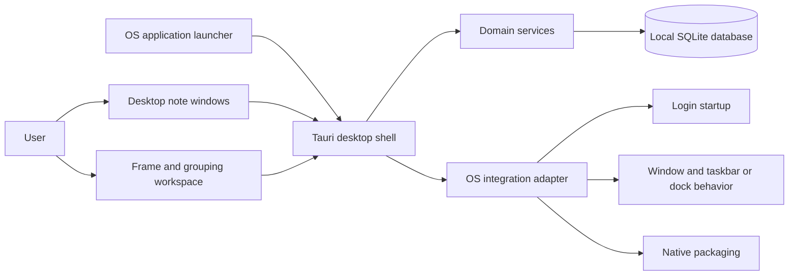

# Desknote Software Architecture Document

**Status:** Proposed baseline; implementation spike required before acceptance  
**Revision:** 0.1  
**Date:** 2026-10-05

## 1. Purpose

Record the proposed first-release architecture and its technical constraints. Platform-specific behavior remains subject to proof-of-concept verification.

## 2. Architecture drivers

- Independent desktop note windows with reliable pin/unpin and lifecycle behavior (SRS FR-003–006).
- A separate freeform workspace with groups/frames (FR-007–011).
- Local persistence, data integrity, offline core use (FR-021–022, QR-002–003).
- Compiled executable distribution on agreed operating systems (QR-001).
- Startup-at-login and taskbar/dock integration (FR-017–020).
- Maintainability in light of the user's JS/React/Next.js/TypeScript/Python/PyQt experience.
- Use JSX/React as the preferred frontend authoring style; proposed bundler is Vite.

## 3. Current implementation (not an approved target decision)

The repository currently uses Tauri 2, Rust, Vite, plain JavaScript, and SQLite. The frontend currently renders a single board and opens note editing in a dialog. Rust commands handle persistence and create pinned-note windows. Current package configuration targets Linux `deb` and AppImage. This is a baseline to evaluate, not a commitment to retain.

## 4. Proposed logical components

- **Desktop shell/lifecycle:** OS windows, startup, taskbar/dock presence, single-instance activation, app exit.
- **Desktop note surface:** one window per pinned note, note controls, positioning and visibility.
- **Workspace UI:** canvas, zoom/pan, groups, frames, selection and editing.
- **Domain/service layer:** note, schedule, recurrence, pin, and workspace operations.
- **Persistence layer:** local database, schema migrations, backup/export.
- **Platform adapters:** login launch, window behavior, packaging, and OS-specific integration.

## 5. Proposed architecture decision

Adopt **Tauri 2 + Vite + React + JSX + Rust + SQLite** as the proposed first-release architecture. Keep platform-specific window management behind a Rust platform adapter. Use local SQLite with versioned migrations. Android, automatic recurrence advancement, and portable distribution packages are outside the first release. See [ADR-001](adr/ADR-001-desktop-stack.md).

## 6. Component and deployment views

```mermaid
stateDiagram-v2
  [*] --> Starting
  Starting --> WorkspaceVisible: launch with no resident instance
  Starting --> NotesOnly: autostart with pinned notes
  Starting --> WorkspaceVisible: user activates existing app via launcher
  WorkspaceVisible --> NotesOnly: Ctrl+D or close workspace
  NotesOnly --> WorkspaceVisible: open from note menu or relaunch via OS launcher
  NotesOnly --> NotesOnly: pin/unpin notes; last unpin keeps process resident
  WorkspaceVisible --> NotesOnly: close workspace while pins exist
```

## 7. Quality and risk notes

OS window managers differ in close, minimize, always-on-top, and taskbar behavior. The required behavior is: no taskbar-running indication while only pinned notes are visible; show the app in the taskbar while the workspace is displayed; Ctrl+D minimizes only the workspace; closing/leaving the workspace keeps the process resident; unpinning the last note leaves it resident invisibly. Validate whether each target OS can represent this reliably, including the macOS Dock equivalent and Linux desktop environments, with an early technical spike before finalizing the architecture.

## 8. Frontend comparison (2026-10-05)

| Option | JSX/React | Fit for a local desktop frontend | Trade-off |
|---|---|---|---|
| Tauri + Vite + React | Yes | Strong fit: builds static frontend assets for Tauri and supports the React/JSX component workflow | Does not include Next.js routing/conventions; add libraries only where needed |
| Tauri + Next.js static export | Yes | Technically supported when configured with `output: 'export'` and the exported `out` directory as Tauri's `frontendDist` | Server-dependent Next.js features are unavailable in the packaged app; adds framework configuration without an evident current need |

### Decision (Proposed baseline)

Use **Tauri + Vite + React + JSX** for the first release. It satisfies the explicit JSX preference while fitting a local desktop UI that calls native commands and does not currently require a Next.js server, SEO, or server-rendered web routes. Keep Next.js as a valid option if requirements emerge that benefit from its routing or static generation. Confirm the choice after a small build and multi-window integration spike on the agreed target operating systems.

References: [Tauri Next.js guide](https://v2.tauri.app/start/frontend/nextjs/), [Tauri frontend configuration](https://v2.tauri.app/start/frontend/), [Next.js static exports](https://nextjs.org/docs/app/guides/static-exports), [React JSX](https://react.dev/learn/writing-markup-with-jsx).
